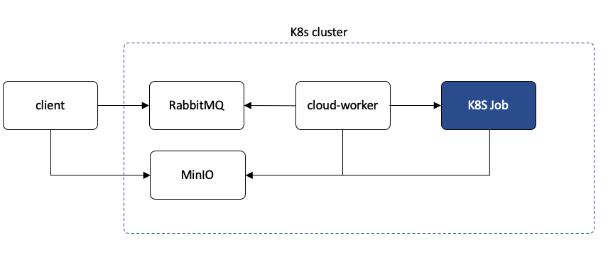

# MSTC Cloud Worker
This project provides a Worker that consumes work requests from a queue, submits Kubernetes jobs and writes responses back. The worker is written in Java, a test client has been provided with Python in `src/test/python`. The test client is is an embedded project that uses `poetry`, and can be found in the `src/test/python` directory.

This document is organized as follows:

* [Overview](#Overview)
* [Building the project](#building-the-project)
* [Setting up Kubernetes](#setting-up-kubernetes)
* [Deploying Services to Kubernetes](#deploying-services-to-kubernetes)
* [Running the Python Client](#running-the-python-client)
* [Running ASTROS](#running-astros)
* [Running Cloud Worker Tests](#running-cloud-worker-tests)
* [Gradle Tasks](#gradle-tasks)


## Overview
The `cloud-worker` is a Spring Boot service, and also uses the [Fabric8's Java Kubernetes Client](https://github.com/fabric8io/kubernetes-client) to dynamically create Kubernetes Jobs.



**Client performs the following:**

1. Uploads input data to a MinIO `input bucket`
2. Submits request to RabbitMQ, providing the `image` name, `job name`, `input-bucket`, optional `output-bucket` (if not provided the `input bucket` will be used).

**Cloud-Worker then:**

1. Consumes work
2. Unwraps request, obtains the `image` to run, a name for the `job`, an optional `timeout` (defaults to 15 minutes), the `input bucket` and optional `output bucket`. 
3. These values are then configured into a Kubernetes Job. The `input bucket` and optional `output bucket` are set as values for environment variables `INPUT_BUCKET` and `OUTPUT_BUCKET` respectively.
4. The Job is submitted and observed. NOTE: The Job is configured to use `IfNotPresent`for the image pull policy.
5. Once complete, the `cloud-worker` captures the job's log file, and writes it to the `output bucket`.

**K8S Job**

1. Is expected to download all files in the `input bucket`
2. Do it's thing, and
3. Uploads the files it produces as outputs to the `output bucket`. Once the client receives notification, it can then go pick up all files. NOTE: Should be noted that the `MINIO_SERVICE_HOST` and `MINIO_SERVICE_PORT` environment variables will have been set into the environment of the K8s job as well.

The Kubernetes Job is configured for automatic cleanup after it is finished as described [here](https://kubernetes.io/docs/concepts/workloads/controllers/ttlafterfinished/). The TTL (time to live) mechanism is set for 30 seconds.

###Dependencies
For the Java project:

* [Lombok](https://projectlombok.org/) is used to generate getters, setters, constructors and builder capabilities for some classes.
* [Spring Boot](https://spring.io/projects/spring-boot) for stand alone RESTful application
* [Spring AMQP](https://spring.io/projects/spring-amqp) for RabbitMQ support
* [Fabric8's Java Kubernetes Client](https://github.com/fabric8io/kubernetes-client) to deploy, and observe Kubernetes jobs.
* [Spring Actuator](https://docs.spring.io/spring-boot/docs/1.3.5.RELEASE/reference/html/production-ready-monitoring.html) for monitoring and management over HTTP
* [Jackson](https://github.com/FasterXML/jackson) for JSON support
* [MinIO Java Client](https://docs.min.io/docs/java-client-quickstart-guide)

For the Python tester project:

* [Pika](https://pypi.org/project/pika/) for AMQP Python support
* [MinIO Python Client](https://docs.min.io/docs/python-client-quickstart-guide.html)


## Building the project
The project requires Java 11 and uses Gradle to build the project. Its recommended that you add [this](https://github.com/gdubw/gng) utility to your machine, it'll make it easier running `gradlew`.

I also recommend using [sdkman](https://sdkman.io) to assist in managing Java versions. 

To build the docker image run:

`gw docker`


## Setting up Kubernetes
In order for the `mstc-cloud-worker` to create, monitor and work with Kubernetes jobs, it needs to have a service account. A service account provides an identity for a process that runs in a pod.

The `config/service-account.yaml` file provides the setup to do this. In order to enable this run:

`kubectl apply -f config/service-account.yaml`

This will also setup the `mstc-dev` namespace (if not already created). If you want to switch to the `mstc-dev` namespace as the default, run:

`kubectl config set-context --current --namespace=mstc-dev`

TODO: There is still work to be done to setup a secret to hold your username and password.

## Deploying Services to Kubernetes
We'll need to deploy both RabbitMQ and MinIO to Kubernetes, as well as the `mstc-cloud-worker`. Charts have been setup in the charts directory.

```
charts
└── mstc-cloud-worker
    ├── Chart.yaml
    ├── charts
    │   ├── minio
    │   │   ├── Chart.yaml
    │   │   ├── templates
    │   │   │   ├── deployment.yaml
    │   │   │   └── service.yaml
    │   │   └── values.yaml
    │   └── mstc-work-queue
    │       ├── Chart.yaml
    │       ├── templates
    │       │   ├── deployment.yaml
    │       │   └── service.yaml
    │       └── values.yaml
    ├── templates
    │   ├── deployment.yaml
    │   └── service.yaml
    └── values.yaml
```
You'll notice a 2nd level `charts` directory. MinIO and RabbitMQ are configured as dependencies of the `mstc-cloud-worker`. If you look into the `mstc-cloud-worker`'s `Chart.yaml` file you'll see:

```
dependencies:
  - name: minio
    version: 0.1.0
    repository: file://charts/minio
  - name: mstc-work-queue
    version: 0.1.0
    repository: file://charts/mstc-work-queue
```
If you now run:

`helm dependency list charts/mstc-cloud-worker`

You should see:

```
NAME           	VERSION	REPOSITORY                     STATUS
minio          	0.1.0  	file://charts/minio            unpacked    
mstc-work-queue	0.1.0  	file://charts/mstc-work-queue. unpacked   
```

To turn the `unpacked` status to `ok`, run:

`helm dependency build charts/mstc-cloud-worker`

This will produce:

```
Saving 2 charts
Deleting outdated charts
```

Then run:

`helm dependency list charts/mstc-cloud-worker`

You should see:

```
NAME           	VERSION	REPOSITORY                     STATUS
minio          	0.1.0  	file://charts/minio            ok    
mstc-work-queue	0.1.0  	file://charts/mstc-work-queue. ok   
```


When you want to deploy this to Kubernetes, there are tasks in the build.gradle file:

* `helmInstall`
* `helmUninstall`

If you want to install/unistall separately run the following:

`helm (un)install mstc-cloud-worker charts/mstc-cloud-worker`

Once you have deployed the project, you can get a view of whats running by either running:

`kubectl get all -n mstc-dev`

or

`gw list`

```
NNAME                                     READY   STATUS    RESTARTS   AGE
pod/minio-84d87f5f76-x79sn               1/1     Running   0          18s
pod/mstc-cloud-worker-6ff966fdf9-krqbt   1/1     Running   0          18s
pod/mstc-work-queue-744986cb5c-95m66     1/1     Running   0          18s

NAME                        TYPE        CLUSTER-IP       EXTERNAL-IP   PORT(S)             AGE
service/minio               ClusterIP   10.107.165.122   <none>        9000/TCP,9001/TCP   18s
service/mstc-cloud-worker   ClusterIP   10.105.184.209   <none>        8080/TCP            18s
service/mstc-work-queue     ClusterIP   10.111.3.84      <none>        5672/TCP            18s

NAME                                READY   UP-TO-DATE   AVAILABLE   AGE
deployment.apps/minio               1/1     1            1           18s
deployment.apps/mstc-cloud-worker   1/1     1            1           18s
deployment.apps/mstc-work-queue     1/1     1            1           18s

NAME                                           DESIRED   CURRENT   READY   AGE
replicaset.apps/minio-84d87f5f76               1         1         1       18s
replicaset.apps/mstc-cloud-worker-6ff966fdf9   1         1         1       18s
replicaset.apps/mstc-work-queue-744986cb5c     1         1         1       18s

```

If you've got to here, you'll want to run something. You'll first need to `port-forward` for RabbitMQ:

```
kubectl -n mstc-dev port-forward mstc-work-queue-744986cb5c-nr47l 5672:5672                                                         
Forwarding from 127.0.0.1:5672 -> 5672
Forwarding from [::1]:5672 -> 5672
```

This maps `localhost` port `5672` to the pods port `5672`. If you want to access RabbitMQ's admin page, you'll also need to do the same for port `15672`. Note that you'll need different terminals for the `port-forward` command, or you can run it in the background `&`.

And don't forget you'll also need to do the same for MinIO:

```
kubectl -n mstc-dev port-forward minio-84d87f5f76-w2stq 9000:9000
Forwarding from 127.0.0.1:9000 -> 9000
Forwarding from [::1]:9000 -> 9000
```

If you want to open the MinIO admin, you'll need to map port `9001` as well.

Custom Gradle task have been added and found in `gradle/k8shelper.gradle`. This file provides 2 custom tasks:

`portForward` and `portForwardStop`.

The `portForward` task is configured in the `build.gradle` file:

```groovy
portForward {
    names["minio"] = [9000, 9001]
    names["mstc-work-queue"] = [5672, 15672]
    names["mstc-cloud-worker"] = 8080
    namespace = "mstc-dev"
}
```

This tells `portForward` to look for pods that have names that start with `minio`, `mstc-work-queue` and `mstc-cloud-worker`, and map the ports respectively. Note that if there is more than one port you need to

The `portForwardStop` task looks for a file that contains the pids of the `kubectl` processes that `portForward` task created, and kills those processes.

## Running the Python Client
The Python client is a test case. Just run `pytest`. However, you first need to build the test Docker image. You can do that in one of two ways:

1. cd to the `src/test/python/mstc-cloud-worker` directory
2. Run `poetry shell`
3. Run `make dist`. This will create a Docker image containing the `mstc_cloud_worker/main.py` file. That simple app grabs environment variables, logs some messages, sleeps for 5 seconds and returns.

Simpler way is to run `./gw pytest`. This also buiulds the docker image.

Before running `pytest` it is helpful to get a new terminal and follow the logs of the `mstc-cloud-worker`:

`kubectl logs -n mstc-dev mstc-cloud-worker-6ff966fdf9-b27ml --follow`

You'll then be following the log, you'll see something like this:

```
 |  \/  / ___|_   _/ ___|  / ___| | ___  _   _  __| | \ \      / /__  _ __| | _____ _ __
 | |\/| \___ \ | || |     | |   | |/ _ \| | | |/ _` |  \ \ /\ / / _ \| '__| |/ / _ \ '__|
 | |  | |___) || || |___  | |___| | (_) | |_| | (_| |   \ V  V / (_) | |  |   <  __/ |
 |_|  |_|____/ |_| \____|  \____|_|\___/ \__,_|\__,_|    \_/\_/ \___/|_|  |_|\_\___|_|

2022-05-06 16:46:10.766  INFO 1 --- [           main] mstc.cloud.worker.WorkerApplication      : Starting WorkerApplication using Java 11.0.14 on mstc-cloud-worker-6ff966fdf9-rmp5s with PID 1 (/app.jar started by root in /)
2022-05-06 16:46:10.774 DEBUG 1 --- [           main] mstc.cloud.worker.WorkerApplication      : Running with Spring Boot v2.6.4, Spring v5.3.16
2022-05-06 16:46:10.775  INFO 1 --- [           main] mstc.cloud.worker.WorkerApplication      : The following 1 profile is active: "local"
2022-05-06 16:46:13.794  INFO 1 --- [           main] o.s.b.w.embedded.tomcat.TomcatWebServer  : Tomcat initialized with port(s): 8080 (http)
2022-05-06 16:46:13.816  INFO 1 --- [           main] o.apache.catalina.core.StandardService   : Starting service [Tomcat]
2022-05-06 16:46:13.816  INFO 1 --- [           main] org.apache.catalina.core.StandardEngine  : Starting Servlet engine: [Apache Tomcat/9.0.58]
2022-05-06 16:46:13.956  INFO 1 --- [           main] o.a.c.c.C.[Tomcat].[localhost].[/]       : Initializing Spring embedded WebApplicationContext
2022-05-06 16:46:13.956  INFO 1 --- [           main] w.s.c.ServletWebServerApplicationContext : Root WebApplicationContext: initialization completed in 2906 ms
2022-05-06 16:46:15.820  INFO 1 --- [           main] o.s.b.a.e.web.EndpointLinksResolver      : Exposing 13 endpoint(s) beneath base path '/actuator'
2022-05-06 16:46:15.959 DEBUG 1 --- [           main] o.s.a.r.l.SimpleMessageListenerContainer : No global properties bean
2022-05-06 16:46:16.011  INFO 1 --- [           main] o.s.b.w.embedded.tomcat.TomcatWebServer  : Tomcat started on port(s): 8080 (http) with context path ''
2022-05-06 16:46:16.013 DEBUG 1 --- [           main] o.s.a.r.l.SimpleMessageListenerContainer : Starting Rabbit listener container.
2022-05-06 16:46:16.014  INFO 1 --- [           main] o.s.a.r.c.CachingConnectionFactory       : Attempting to connect to: mstc-work-queue:5672
2022-05-06 16:46:16.153  INFO 1 --- [           main] o.s.a.r.c.CachingConnectionFactory       : Created new connection: connectionFactory#6f70f32f:0/SimpleConnection@bcb09a6 [delegate=amqp://guest@10.98.6.2:5672/, localPort= 51542]
2022-05-06 16:46:16.160 DEBUG 1 --- [           main] o.s.amqp.rabbit.core.RabbitAdmin         : Initializing declarations
2022-05-06 16:46:16.178 DEBUG 1 --- [           main] o.s.a.r.c.CachingConnectionFactory       : Creating cached Rabbit Channel from AMQChannel(amqp://guest@10.98.6.2:5672/,1)
2022-05-06 16:46:16.195 DEBUG 1 --- [           main] o.s.amqp.rabbit.core.RabbitTemplate      : Executing callback RabbitAdmin$$Lambda$907/0x000000010059d840 on RabbitMQ Channel: Cached Rabbit Channel: AMQChannel(amqp://guest@10.98.6.2:5672/,1), conn: Proxy@648ee871 Shared Rabbit Connection: SimpleConnection@bcb09a6 [delegate=amqp://guest@10.98.6.2:5672/, localPort= 51542]
2022-05-06 16:46:16.195 DEBUG 1 --- [           main] o.s.amqp.rabbit.core.RabbitAdmin         : declaring Exchange 'mstc.exchange'
2022-05-06 16:46:16.201 DEBUG 1 --- [           main] o.s.amqp.rabbit.core.RabbitAdmin         : declaring Queue 'mstc.queue.work'
2022-05-06 16:46:16.209 DEBUG 1 --- [           main] o.s.amqp.rabbit.core.RabbitAdmin         : Binding destination [mstc.queue.work (QUEUE)] to exchange [mstc.exchange] with routing key [mstc.queue.work]
2022-05-06 16:46:16.214 DEBUG 1 --- [           main] o.s.amqp.rabbit.core.RabbitAdmin         : Declarations finished
2022-05-06 16:46:16.223 DEBUG 1 --- [ntContainer#0-1] o.s.amqp.rabbit.core.RabbitTemplate      : Executing callback RabbitAdmin$$Lambda$912/0x000000010059cc40 on RabbitMQ Channel: Cached Rabbit Channel: AMQChannel(amqp://guest@10.98.6.2:5672/,1), conn: Proxy@648ee871 Shared Rabbit Connection: SimpleConnection@bcb09a6 [delegate=amqp://guest@10.98.6.2:5672/, localPort= 51542]
2022-05-06 16:46:16.228 DEBUG 1 --- [ntContainer#0-1] o.s.a.r.listener.BlockingQueueConsumer   : Starting consumer Consumer@27f1bbe0: tags=[[]], channel=null, acknowledgeMode=AUTO local queue size=0
2022-05-06 16:46:16.245 DEBUG 1 --- [pool-1-thread-3] o.s.a.r.listener.BlockingQueueConsumer   : ConsumeOK: Consumer@27f1bbe0: tags=[[amq.ctag-rua_ZwOHPn3JdLtttEepNA]], channel=Cached Rabbit Channel: AMQChannel(amqp://guest@10.98.6.2:5672/,1), conn: Proxy@648ee871 Shared Rabbit Connection: SimpleConnection@bcb09a6 [delegate=amqp://guest@10.98.6.2:5672/, localPort= 51542], acknowledgeMode=AUTO local queue size=0
2022-05-06 16:46:16.245 DEBUG 1 --- [ntContainer#0-1] o.s.a.r.listener.BlockingQueueConsumer   : Started on queue 'mstc.queue.work' with tag amq.ctag-rua_ZwOHPn3JdLtttEepNA: Consumer@27f1bbe0: tags=[[]], channel=Cached Rabbit Channel: AMQChannel(amqp://guest@10.98.6.2:5672/,1), conn: Proxy@648ee871 Shared Rabbit Connection: SimpleConnection@bcb09a6 [delegate=amqp://guest@10.98.6.2:5672/, localPort= 51542], acknowledgeMode=AUTO local queue size=0
2022-05-06 16:46:16.262  INFO 1 --- [           main] mstc.cloud.worker.WorkerApplication      : Started WorkerApplication in 7.098 seconds (JVM running for 8.632)

```
Then run `pytest`.

The client submits the following data (as JSON):

```json
{"image": "mstc/python-test:latest",
 "jobName": "test-job",
 "inputBucket" : "in.bucket",
} 
```

Optionally you can submit:

```json
{"image": "mstc/python-test:latest",
 "timeOut": 5,
 "jobName": "test-job",
 "inputBucket" : "in.bucket",
 "outputBucket" : "out.bucket",
} 
```

* If the `timeOut` property is not provided, the default is 15 minutes.
* If the `output bucket` is not provided, the input bucket is used.

NOTE: Going forward, the image name may also include a registry hostname.

## Running ASTROS
There is a test case included in the project that will run ASTROS. However, you'll need to build the Docker image for ASTROS from the `mstc-astros-eap` project, using rthe `job` branch. Once you've built the image in the `mstc-astros-eap` project using `make dist`, you'll see the following after you run `docker images`

```
mstc/astros-eap-12.5                                      0.3.0
```

There is a fixture in `conftest.py` that checks if this specific image exists before running the test case. If the image exists, the test case uploads `AstrosModalAGARD445.bdf` and `AstrosModalAGARD445.dat` to the `astros.inputs` bucket and submits:

```json
{"image": "mstc/astros-eap-12.5:0.3.0",
 "jobName": "astros-job",
 "inputBucket" : "astros.inputs",
 "outputBucket" : "astros.outputs"
}
```

Once complete the output bucket contains 2 files:

1. `AstrosModalAGARD445.out.txt`
2. The job's log file


## Running Cloud Worker Tests
TODO

## Gradle Tasks
You can get the tasks for the project by running
`gw tasks --all`

Below is a summary of some of the custom tasks

| Task Name | Description
|-----------|-------------|
| helmInstall | Installs helm charts
| helmUninstall | Uninstalls helm charts
| portForward | Runs kubectl port-forward for discovered services
| portForwardStop | Destroys kubectl port-forward processes
| docker | Creates docker image for the project
| pytest | Runs pytest for the Python test client
| makePythonDist | Creates Docker image for Python test client
| list | Runs `kubectl -n mstc-dev get all`


